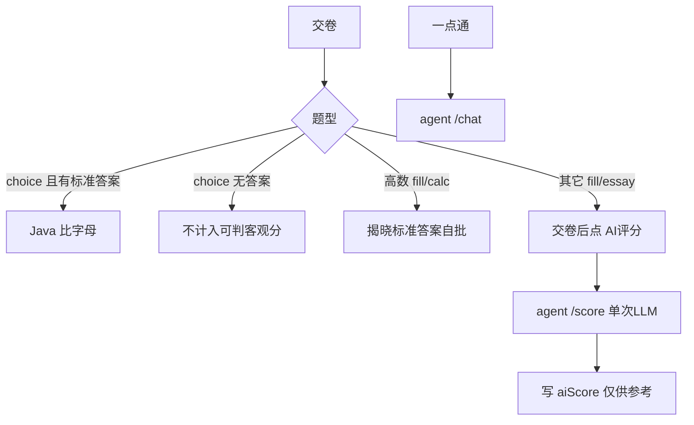

# 题库维护、主观题评分与 Agent / LLM 边界

> 对应现状：`paper` / `paper_question`、`PaperServiceImpl` 客观题判分、`agent-service` `/api/agent/chat` + `/api/agent/score`。  
> 更新：2026-09-12  
> 本文固化真题作答/判分安排；**P1 主观 AI 评分已落地**（`/score` + 交卷后 `ai-score`）。

## 0. 定稿结论（2026-09-11）

范围：历年真题卷面（`paper*`）；**社区不做**；运营上传解析接口仍暂缓。

产品节奏：**先客观机判可用 → 再主观 AI 评分（交卷后用户点「AI 评分」）**；高数填空/计算维持揭晓自批。

| 题型 | 作答 | 判分 |
|------|------|------|
| 单选/多选（有 `answer`） | 选项 | Java 机判；多选存规范串如 `ABD` |
| 选择（无 `answer`） | 可作答 | 暂不机判；UI 提示「暂无标准答案」；实现时不进可判客观分母 |
| 高数填空/计算 | 草稿纸或机打（现状） | 只揭晓标准答案自批，**不 AI** |
| 英语/政治等主观 | 机打文本 | 单次 LLM + 采分点；**不走 chat Agent**；交卷后按需触发 |
| `missing` | 不可答 | 不参与 |

落地顺序：

1. **P0** 客观答案内容：优先广东英语/政治、山东英语/计算机等选择题写入 `answer`，重导 SQL  
   - **已推进**：`import_answers_from_md.py` 批量入库；残年/回忆版仍可能空  
2. **P0.5** 机判小修：无答案的 choice 不进 `objective_total`；多选规范；前端「本卷可机判 x/y」——**已开发**  
3. **P1** 主观评分：`POST /api/agent/score` + practice RestClient；交卷后按钮；练习开 / 模考关——**已开发（2026-09-12）**  
4. **P2**（可后）AI 草拟答案流水线 + 人工校对升 `manual`

本阶段明确不做：社区、运营上传解析接口、用 chat Agent 多步打正式分、高数公式符号等价机判。

**实现备忘（P1）**：

- 表：`paper_attempt_answer.ai_score` / `ai_feedback`（见 `sql/phase1/migrate_paper_ai_score.sql`）
- Agent：清理课程训练预约代码；`system.txt` 改为升学通一点通；`classpath:content/` 复制 `shijuan` 答案 md 供 chat RAG（评分不走 RAG）
- Practice：`POST /api/practice/papers/attempts/{id}/ai-score`；`ul.papers.ai-score-enabled`；`mockExam=true` 拒绝
- 前端：交卷后「AI 评分」，结果标「仅供参考」

---

## 1. 题干和答案同表，PDF 没答案靠 AI 生成——会难维护吗？

**表结构不会因此难维护**（继续用 `paper_question` 一行含 `stem` / `answer` / `analysis` 即可）。

真正会变难的是 **内容治理**，不是「一张表」：

- AI 生成的答案/解析可能错，卷子一多无人校对就会污染判分。
- 建议工程约束（不必先拆表）：
  - 增加来源标记，例如 `answer_source`：`manual` / `ai_draft` / `parsed`
  - 仅 `manual`（或已校对）参与客观题正式机判
  - UI 标明「AI 草拟，仅供参考」；高数等已人工定稿的保持 `manual`
- **MySQL 仍是主库**；RAG/向量库若以后要做答疑检索，是同步副本，改题仍先改 MySQL。

录入流程建议：

```text
PDF → 结构化题干入库 →（可选）AI 草拟 answer/analysis/采分点
    → 人工抽检 → answer_source=manual 后才对客观题正式机判
```

与 [历年真题存储与PDF解析.md](./历年真题存储与PDF解析.md) 一致：判分读的是库里的 `paper_question.answer`，不会交卷时现场再解析 PDF。

---

## 2. 评分怎么拆（结合本产品）

| 题型 | 做法 | 谁做 |
|------|------|------|
| 选择题等客观题（有标准答案） | 比 `paper_question.answer` 字母 | **本地 Java**（已有 `PaperServiceImpl.submit`） |
| 选择题无 `answer` | 不作客观机判 | 本地跳过；前端提示 |
| 高数填空/计算 | 不机打公式、不 AI 打分；交卷揭晓标准答案自批 | 本地 + 展示 `answer` |
| 英语/政治等主观题 | 按 **采分点** 给分，允许表述不同 | **单次 LLM 评分接口**（`/api/agent/score`），**不是**聊天 Agent |
| 一点通答疑/拓展 | 多轮对话 + RAG | 现有 `AgentController` `/api/agent/chat` |

基线已预留二期：`POST /api/agent/score`（见 [技术栈基线备忘.md](./技术栈基线备忘.md) §2.4）——适合做成「评分专用单次调用」，与 chat 解耦。



### 2.1 数据怎么存（尽量少改表）

- 标准答案继续用 `paper_question.answer` / `analysis`
- 建议增量：`answer_source`（`manual` / `ai_draft` / `parsed`）— 仅 `manual`（或已校对）参与正式客观机判
- 主观采分点：先约定写入 `analysis` 结构化文本，或后加 `rubric_json`；按 `questionId` 精确取，**不用向量乱匹配**
- 用户侧：`paper_attempt_answer` 增加 `ai_score` / `ai_feedback`（可空）；`paper_attempt` 仍以 `objective_*` 为主，主观 AI 分单独展示「仅供参考」

工程要点：

- AI 分波动：存 `aiScore`，文案「仅供参考」；需要时可加 `manualScore` 覆盖
- 按需调用（交卷后用户点「AI 评分」）、同答缓存、可关开关；**练习开 / 模考关**
- **不建议**：让聊天 Agent 自主多步推理去打正式分（不稳定、贵、难审计）

每日一练 / 随机刷题另有 `question` + `/submit`，与真题表分离，**不混改**。

---

## 3. 为什么把 Agent 和 LLM 分开说？（都在 agent-service 里吗？）

**可以都放在同一个 Maven 模块 / 微服务 `agent-service` 里**——分开说的是**能力边界**，不是「必须拆成两个服务」。

| 说法 | 指什么 | 落在哪 |
|------|--------|--------|
| **LLM** | 大模型能力本身：一次 prompt → 一次 completion（像计算器） | 任意服务里调 SDK 都行 |
| **Agent（答疑）** | 多轮会话、记忆、工具、RAG、「一点通」产品形态 | 已有 `/api/agent/chat`（及 stream） |
| **主观题评分** | 固定输入输出的**单次**打分（题干+答案+采分点 → JSON 分数） | 规划 `/api/agent/score`，建议仍挂在 `agent-service`，但**不走 chat 循环** |

豆包容易混在一起的点：

- 「都在 agent 模块」= **部署/代码仓库单元**（一个 Spring Boot）  
- 「Agent vs LLM 评分」= **两种用法**：对话 Agent ≠ 单次 LLM 判分  

可记成：

- **LLM** = 引擎  
- **`/chat` Agent** = 用引擎做答疑  
- **`/score`** = 用引擎做一次打分（同模块两个 Controller 方法即可）  

### 3.1 评分跨模块要不要 Feign？

交卷在 **`practice-service`**，评分接口若在 **`agent-service`**：

```text
前端交卷 → practice.submit（客观题本地判）
         →（主观题，用户点 AI 评分）practice 调 agent /score → 写回 attempt
```

| 方式 | 说明 |
|------|------|
| **Feign（推荐长期）** | 符合现有微服务风格；需补 `api-service`/共享 DTO（计划 1.2.x 暂缓） |
| **WebClient / RestTemplate** | 不引入 Feign 也能调；**MVP 采用** |
| **经网关 HTTP** | 多一跳，一般不必要 |
| **practice 直接调 LLM** | 不推荐：密钥与 Agent 配置分裂，评分与答疑无法共用限流/模型配置 |

结论：**跨服务调用「需要」，Feign「不必须」**——暂缓 Feign 时用 WebClient 调 `/api/agent/score` 即可。  
若把 score 暂时写在 practice 里调同一套 SDK，也能跑，但和「模型能力集中在 agent-service」的基线不一致。

---

## 4. 和当前仓库的落差（后续实现清单）

已有：

- 客观题本地判分；高数定稿有 `answer`；其它科多为空答案；agent 仅 chat；粤/鲁结构化卷面已上架。

未有（按定稿节奏实现）：

1. **P0** 高频科选择题补 `answer` 并重导 —— **已推进**（md 批量入库；残年/回忆版可能仍空）  
2. **P0.5** 无答案 choice 不进 `objective_total`；多选规范；前端可机判计数 —— **已开发**  
3. **P1** `POST /api/agent/score` + 交卷后按需评分 + 练习/模考开关 + `ai_score`/`ai_feedback` —— **已开发（2026-09-12）**  
4. **P2**（可选）PDF 录入后 AI 草拟答案流水线，人工校对后再机判  

**下一步**：联调评分；§2.4.3 PDF/MD 完整对齐见分期计划 **暂缓**。社区与 §2.1.2 不做。
