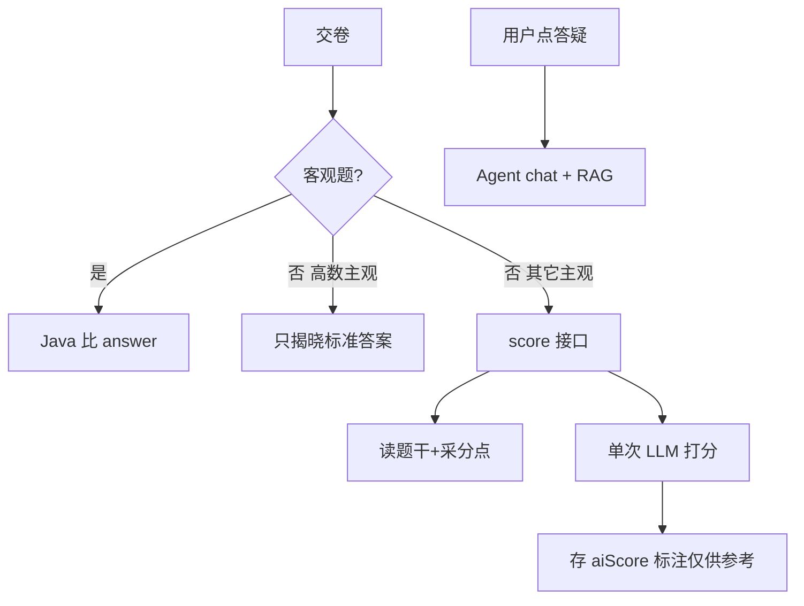

# 题库维护、主观题评分与 Agent / LLM 边界

> 对应现状：`paper` / `paper_question`、`PaperServiceImpl` 客观题判分、`agent-service` `/api/agent/chat`；基线预留 `/api/agent/score`。  
> 更新：2026-09-10  
> 本文只固化设计结论，**尚未改表/实现 score 接口**。

## 1. 题干和答案同表，PDF 没答案靠 AI 生成——会难维护吗？

**表结构不会因此难维护**（继续用 `paper_question` 一行含 `stem` / `answer` / `analysis` 即可）。

真正会变难的是 **内容治理**，不是「一张表」：

- AI 生成的答案/解析可能错，卷子一多无人校对就会污染判分。
- 建议工程约束（不必先拆表）：
  - 增加来源标记，例如 `answer_source`：`manual` / `ai_draft` / `parsed`
  - 或扩展 `has_answer`：仅 `manual` / 已校对 才参与客观题正式机判
  - UI 标明「AI 草拟，仅供参考」；高数等已人工定稿的保持 `manual`
- **MySQL 仍是主库**；RAG/向量库若以后要做答疑检索，是同步副本，改题仍先改 MySQL。

录入流程建议：

```text
PDF → 结构化题干入库 →（可选）AI 草拟 answer/analysis/采分点
    → 人工抽检 → answer_source=manual 后才对客观题正式机判
```

与 [历年真题存储与PDF解析.md](./历年真题存储与PDF解析.md) 一致：判分读的是库里的 `paper_question.answer`，不会交卷时现场再解析 PDF。

---

## 2. 评分怎么拆（结合本产品）

| 题型 | 做法 | 谁做 |
|------|------|------|
| 选择题等客观题 | 比 `paper_question.answer` 字母 | **本地 Java**（已有 `PaperServiceImpl.submit`） |
| 高数填空/计算 | 不机打公式、不 AI 打分；交卷揭晓标准答案自批 | 本地 + 展示 `answer` |
| 英语/政治等主观题 | 按 **采分点** 给分，允许表述不同 | **单次 LLM 评分接口**（`/api/agent/score` 或 practice 侧封装），**不是**聊天 Agent |
| 一点通答疑/拓展 | 多轮对话 + RAG | 现有 `AgentController` `/api/agent/chat` |

基线已预留二期：`POST /api/agent/score`（见 [技术栈基线备忘.md](./技术栈基线备忘.md) §2.4）——适合做成「评分专用单次调用」，与 chat 解耦。



工程要点：

- 采分点存在 MySQL（可先放 `analysis`，或后续加 `rubric_json`），**按 `questionId` 精确取**，不要用向量相似度乱找「像的题」当采分标准。
- AI 分波动：存 `aiScore`，文案「仅供参考」；需要时可加 `manualScore` 覆盖。
- 按需调用（用户点「提交评分」或交卷后异步）、同答缓存、可关开关；模考模式可关 AI 分。

**不建议**：让聊天 Agent 自主多步推理去打正式分（不稳定、贵、难审计）。

---

## 3. 为什么把 Agent 和 LLM 分开说？（都在 agent-service 里吗？）

**可以都放在同一个 Maven 模块 / 微服务 `agent-service` 里**——分开说的是**能力边界**，不是「必须拆成两个服务」。

| 说法 | 指什么 | 落在哪 |
|------|--------|--------|
| **LLM** | 大模型能力本身：一次 prompt → 一次 completion（像计算器） | 任意服务里调 SDK 都行 |
| **Agent（答疑）** | 多轮会话、记忆、工具、RAG、「一点通」产品形态 | 已有 `/api/agent/chat`（及 stream） |
| **主观题评分** | 固定输入输出的**单次**打分（题干+答案+采分点 → JSON 分数） | 规划 `/api/agent/score`，建议仍挂在 `agent-service`，但**不走 chat 循环** |

豆包容易混在一起的点：

- 「都在 agent 模块」= **部署/代码仓库单元**（一个 Spring Boot）  
- 「Agent vs LLM 评分」= **两种用法**：对话 Agent ≠ 单次 LLM 判分  

可记成：

- **LLM** = 引擎  
- **`/chat` Agent** = 用引擎做答疑  
- **`/score`** = 用引擎做一次打分（同模块两个 Controller 方法即可）  

**不建议**让聊天 Agent 多步自主推理去打正式分（贵、不稳、难审计）。

### 3.1 评分跨模块要不要 Feign？

交卷在 **`practice-service`**，评分接口若在 **`agent-service`**：

```text
前端交卷 → practice.submit（客观题本地判）
         →（主观题）practice 调 agent /score → 写回 attempt
```

| 方式 | 说明 |
|------|------|
| **Feign（推荐长期）** | 符合现有微服务风格；需补 `api-service`/共享 DTO（计划 1.2.x 暂缓） |
| **WebClient / RestTemplate** | 不引入 Feign 也能调；MVP 够用 |
| **经网关 HTTP** | 多一跳，一般不必要 |
| **practice 直接调 LLM** | 不推荐：密钥与 Agent 配置分裂，评分与答疑无法共用限流/模型配置 |

结论：**跨服务调用「需要」，Feign「不必须」**——有 Feign 更干净；暂缓 Feign 时用 WebClient 调 `/api/agent/score` 即可。  
若把 score 暂时写在 practice 里调同一套 SDK，也能跑，但和「模型能力集中在 agent-service」的基线不一致。

---

## 4. 和当前仓库的落差（后续实现清单）

已有：

- 客观题本地判分；高数定稿有 `answer`；其它科多为空答案；agent 仅 chat。

未有（确认二期再做）：

1. `采分点` 结构化字段（或约定写入 `analysis`）+ 可选 `answer_source`
2. `POST /api/agent/score` 单次评分 + 超时/重试/JSON 校验/分数区间校验
3. 交卷后主观题 AI 分展示（「仅供参考」）+ 练习/模考开关
4. （可选）PDF 录入后 AI 草拟答案流水线，人工校对后再机判

**下一步优先建议**：先补「采分点字段 + score 单次接口 + 练习模式开关」，答疑 Agent 保持独立。
