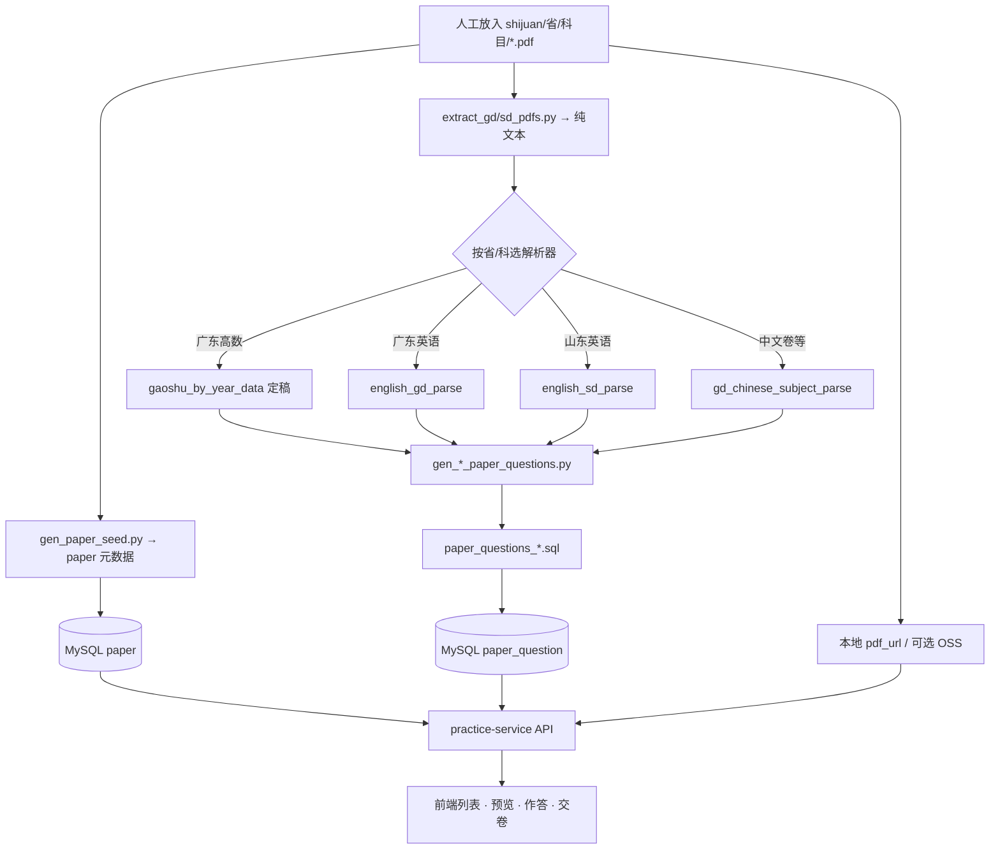
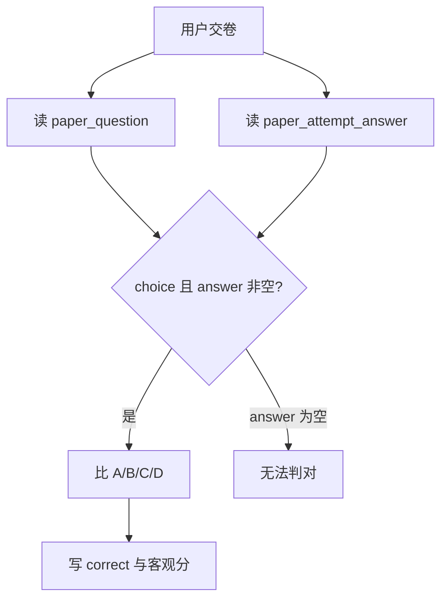

# 历年真题：上传 · 存储 · 解析 · 网页全链路

> 对应实现：`sql/phase1/migrate_paper.sql`、`gen_paper_seed.py`、`gen_gd_paper_questions.py` / `gen_sd_paper_questions.py`、`practice-service` 试卷 API、前端 `PapersPanel` / `PaperExamView`。  
> 更新：2026-09-10（含广东+山东入库、卷面题号/空大题占位、全链路与待办）

---

## 0. 一句话结论

**没有管理后台上传。** 流程是：人工把回忆版 PDF 放进 `shijuan/` → 脚本抽文本并结构化 → SQL 写入 MySQL → `practice-service` 读库 → 前端列表 / 预览 / 作答。  
用户网页**从不**现场解析 PDF；卷面只吃库里已结构化的 `paper_question`。



---

## 1. 「每科上传」怎么做

当前**无在线上传接口**，上新一科 / 一年靠本地文件 + 种子脚本。

### 1.1 放 PDF

目录约定：

```text
shijuan/
  广东专升本-历年真题/{高数|英语|语文|政治理论|管理学|经济学|教育理论|生理学}/
  山东专升本-历年真题/{英语|政治|语文|计算机|高数一|高数二|高数三}/
```

- PDF 默认 gitignore（体积大）；元数据进库，运行时按路径读盘或以后改 OSS。
- 映射关系见 [gen_paper_seed.py](../sql/phase1/gen_paper_seed.py) 的 `FOLDER_MAP`（文件夹名 → 省 + 展示科目名）。

### 1.2 生成试卷元数据行

```bash
cd sql/phase1
python gen_paper_seed.py
# → paper_seed.sql，再导入 MySQL
```

写入 `paper`：`province` / `subject` / `year` / `title` / `pdf_url`（相对 `shijuan` 的路径）/ `published` 等。

本地读盘：`practice-service` 配置 `ul.papers.local-dir` 指向项目下 `shijuan/`（见 `application-local.yml`）。`pdf_url` 也可改成 OSS 完整 URL。

### 1.3 题目另跑解析（不是上传时自动切题）

放好 PDF、有 `paper` 行之后，再执行第 3 节的抽取 → 生成 → 导入，才会有可预览/可作答的题。

---

## 2. 怎么存储（统一表，不分科分表）

**广东 / 山东、高数 / 英语 / 计算机等全部同一套表。** 科目差异只在行内容，不在表结构。

| 表 | 作用 |
|----|------|
| `paper` | 试卷元数据：省、科目、年、标题、PDF 路径、`published` / `has_answer` |
| `paper_question` | **真正的考题**（每题一行） |
| `paper_attempt` | 用户作答会话（非题库） |
| `paper_attempt_answer` | 用户答案明细（非题库） |

建表 / 增量：[migrate_paper.sql](../sql/phase1/migrate_paper.sql)、[migrate_paper_question_section.sql](../sql/phase1/migrate_paper_question_section.sql)

### 2.1 `paper_question` 字段要点

| 字段 | 含义 |
|------|------|
| `seq` | 卷内**排序号**（唯一，含材料行） |
| `paper_no` | **卷面题号**（对标 PDF；材料为 NULL；暂缺题仍有题号） |
| `q_type` | `choice` / `fill` / `calc` / `essay` / `material` |
| `section_title` | 卷面大题标题（如「三、名词解释题…」） |
| `stem` / `options_json` | 题干、选择题选项 |
| `answer` / `analysis` | 标准答案与解析（可空） |
| `score` | 分值 |
| `input_mode` | `answerable`（可机判选择）/ `reveal_only`（交卷揭晓）/ `missing`（回忆版暂缺占位） |

唯一键：`paper (province, subject, year)`；`paper_question (paper_id, seq)`。

### 2.2 种子产物

| 文件 | 内容 |
|------|------|
| [paper_seed.sql](../sql/phase1/paper_seed.sql) | 两省试卷行 |
| [paper_questions_guangdong.sql](../sql/phase1/paper_questions_guangdong.sql) | 广东题目 |
| [paper_questions_shandong.sql](../sql/phase1/paper_questions_shandong.sql) | 山东题目 |

本地核对（MySQL 3308 / 库 `up_learn`）：

```sql
SELECT p.province, p.subject, p.year, p.published, COUNT(q.id) AS n
FROM paper p
LEFT JOIN paper_question q ON q.paper_id = p.id
WHERE p.deleted = 0
GROUP BY p.id
ORDER BY p.province, p.subject, p.year;
```

---

## 3. PDF 怎么解析进 SQL

### 3.1 步骤（广东 / 山东对称）

1. **抽文本**：`pypdf` 读 `shijuan/.../**/*.pdf`  
   - 广东 → [extract_gd_pdfs.py](../sql/phase1/extract_gd_pdfs.py) → `_pdf_extract/`  
   - 山东 → [extract_sd_pdfs.py](../sql/phase1/extract_sd_pdfs.py) → `_pdf_extract_sd/`  
   （均 gitignore）
2. **生成题目列表**：`questions_for(subject, year)` 按科目走专用解析器
3. **写 SQL**：按 `province+subject+year` 找 `paper.id`，`DELETE` 旧题再 `INSERT`，并更新 `published` / `has_answer`
4. **导入**：`docker cp` + `mysql --default-character-set=utf8mb4`（避免 PowerShell 管道转码）

### 3.2 解析路径一览

| 路径 | 适用范围 | 脚本 | 说明 |
|------|----------|------|------|
| **分年定稿** | 广东高等数学 | [gaoshu_by_year_data.py](../sql/phase1/gaoshu_by_year_data.py) | 不解析 PDF；约 20 题/年，**带标准答案** |
| **广东英语专用** | 广东英语 | [english_gd_parse.py](../sql/phase1/english_gd_parse.py) | 阅读 A/B/C 原文 → `material`；完形/语法/写作 | 2022–2024 上架；2025 源「暂无」→ `published=0` |
| **山东英语专用** | 山东英语 | [english_sd_parse.py](../sql/phase1/english_sd_parse.py) | 完形词库 A–J、Reading A/B、翻译/写作；支持 `11-25 暂无` 占位 |
| **中文卷结构解析** | 粤：政治/管理/经济/语文/教育/生理<br>鲁：政治/语文/计算机/高数 I–III | [gd_chinese_subject_parse.py](../sql/phase1/gd_chinese_subject_parse.py) | 按「一、二、三…」大题分段；材料入库；空大题占位 |
| **通用弱解析（兜底）** | 未注册科目 | `parse_mcq_blocks`（在 gen 脚本内） | 只按题号抠 A–D，易丢材料 |

编排入口：

- 广东：[gen_gd_paper_questions.py](../sql/phase1/gen_gd_paper_questions.py)
- 山东：[gen_sd_paper_questions.py](../sql/phase1/gen_sd_paper_questions.py)

### 3.3 中文卷解析要点（对标 PDF）

- 识别「单项/多项选择、名词解释、简答、论述、材料/案例分析、阅读题」等
- `材料一` / `材料 1` → `q_type=material`；其后（1）（2）→ `essay`
- **`paper_no` = 卷面题号**，不从 1 重排；**`section_title` = PDF 大题标题**
- **空大题占位**：仅有大题说明、正文暂缺时，按「共 N 小题」生成 `input_mode=missing`（题干「回忆版中暂缺」），题号连续对标原卷（如教育理论 2025：1–20 暂缺，21 起名词解释）
- 上架门槛：完整四选项够数；或「材料+主观 / 主观为主 / 残卷占位」也可上架
- 不达标：清空该卷题目 + `published=0`，不灌假题

### 3.4 重导命令

```bash
cd sql/phase1

# 广东
python extract_gd_pdfs.py
python gen_gd_paper_questions.py
docker cp paper_questions_guangdong.sql ul-mysql:/tmp/paper_questions_guangdong.sql
docker exec ul-mysql bash -c "mysql -uroot -p1234 --default-character-set=utf8mb4 up_learn < /tmp/paper_questions_guangdong.sql"

# 山东
python extract_sd_pdfs.py
python gen_sd_paper_questions.py
docker cp paper_questions_shandong.sql ul-mysql:/tmp/paper_questions_shandong.sql
docker exec ul-mysql bash -c "mysql -uroot -p1234 --default-character-set=utf8mb4 up_learn < /tmp/paper_questions_shandong.sql"
```

报告（本地临时）：`_reseed_report.txt` / `_reseed_report_sd.txt`。

---

## 4. 怎么到网页供用户使用

| 环节 | 实现 | 行为 |
|------|------|------|
| 列表 | 前端 `PapersPanel` + `/api/practice/papers/**` | 按省/科筛 `published=1` |
| 预览 | `PaperPreviewDialog` + `paperSheet.ts` | 按 `section_title` 分组；题号用 `paper_no`；材料穿插 |
| 作答 | `/paper/:id` → `PaperExamView` | 建 `paper_attempt`；选择/机打写入 `paper_attempt_answer`；`missing` 不可答 |
| 交卷 | `PaperServiceImpl.submit` | 仅 `choice` + `answerable` 且 `answer` 非空才机判；否则揭晓/自批 |
| 下载 PDF | `downloadPaperAsPdf` | **前端把当前卷面渲成 PDF**（已移除服务端 `/pdf` 流式下载半死接口；`paper.pdf_url` 仍保留供运营/以后用） |

排版规则摘要（[paperSheet.ts](../frontend/src/utils/paperSheet.ts)）：

- 有 `sectionTitle` → 按大题标题分组（中文卷 / 山东英语等）
- 否则有 `material` → 按 `seq` 流式穿插（广东英语等）
- 否则按 `q_type` 合成「一、选择题 / 二、填空…」（高数定稿等）

---

## 5. 选择题正确答案：从哪来、怎么判

**一句话：** 标准答案在 `paper_question.answer`；交卷与 `paper_attempt_answer.user_answer` 比字母。无单独答案册表，也不会交卷时再解析 PDF。

| 数据 | 字段 | 含义 |
|------|------|------|
| 标准答案 | `paper_question.answer` | 选择多为 `A`/`B`/`C`/`D` |
| 是否有答案 | `paper.has_answer` | 该卷是否至少一题非空 `answer` |
| 用户答案 | `paper_attempt_answer.user_answer` | 选项字母等 |
| 判分 | `correct` / `objective_score` | 交卷后写入 |

交卷逻辑（[PaperServiceImpl](../backend/practice-service/src/main/java/com/yukimomo/practice/service/impl/PaperServiceImpl.java)）：

1. 只处理 `q_type=choice` 且 `input_mode=answerable`
2. 用户有作答、**`answer` 非空**、字母相等 → `correct=1`
3. `answer` 为空 → 无法判对（客观分母可能仍累计，但得不了分）



**入库现状：** 仅**广东高等数学**定稿带齐 `answer`；两省其它科选择题多数 `answer` 为空 → 交卷客观题几乎判不出分。补答案只需写入同字段后重导，**不必改表**。

```sql
SELECT p.province, p.subject, p.year,
       SUM(q.answer IS NOT NULL AND q.answer <> '') AS with_ans,
       SUM(q.q_type = 'choice') AS choices
FROM paper p
JOIN paper_question q ON q.paper_id = p.id
WHERE p.deleted = 0
GROUP BY p.province, p.subject, p.year
ORDER BY p.province, p.subject, p.year;
```

主观题 AI 评分、采分点与 Agent 边界见 [主观题评分与Agent边界.md](./主观题评分与Agent边界.md)。

---

## 6. 为什么有的卷仍不完整？

不是「按科分表丢了字段」，而是：

1. **源是考生回忆版**：缺题、「暂无」「选项不详」「案例材料暂缺」
2. **抽取文本残缺**：部分年选项几乎抽不出
3. **质量门槛**：结构不可用则下架；可用则上架（可含 `missing` 占位）

近期策略下的典型结果：

| 范围 | 状态 |
|------|------|
| 广东高数 2022–2025 | 定稿完整 + 有答案 |
| 广东英语 2022–2024 | 专用解析上架；2025 下架 |
| 广东政治/管理/经济/语文/教育/生理 | 中文卷解析上架；材料/空大题已尽量对标 PDF |
| 山东英语/语文/计算机/高数 I–III | 已上架；英语 2025 阅读段多为暂缺占位 |
| 山东政治 2025 | 回忆版极简（约 4 道主观），已上架 |

---

## 7. 还差什么（待办优先级）

产品闭环（两省列表 → 预览 → 作答 → 客观题判分/揭晓）已通。主要缺口：

| 优先级 | 缺口 | 说明 |
|--------|------|------|
| **P0** | **客观题标准答案** | 除广东高数外几乎为空；先补英/政/计算机等高频科 `answer`，否则交卷客观分无意义 |
| **P1** | **主观题 score 接口** | `/api/agent/score`、采分点、与 chat Agent 解耦——见边界文档，**尚未实现** |
| **P2** | **答案来源治理** | 建议 `answer_source=manual\|ai_draft\|parsed`；仅校对后才正式机判 |
| **P3** | **运营上传后台 / 解析接口** | 见分期计划 **§2.1.2（暂缓，非当前主攻）**；现靠本地 PDF + Python + SQL |
| **P4** | **换完整源 / 定稿校对** | 回忆版天花板；解析毛刺（漏题、材料切块）靠换 PDF 或 `*_by_year_data` |
| **P5** | **原版/答案 PDF 下载** | `answer_pdf_url` 基本空；前端「下载」是生成卷面，不是招生原件 |

补全残卷的工程套路（**不必改表**）：

1. 换完整 PDF 或人工定稿 → `*_by_year_data.py` / 专用 parse  
2. 在对应 `gen_*` 注册或调门槛后重导  
3. 答案 PDF / 人工答案写入同一 `answer`/`analysis`（主观采分点可放 `analysis` 或后续 `rubric_json`）  
4. AI 草拟仅作草稿，校对后才机判  

硬约束：回忆版写「暂无」的卷**无法**单靠解析变完整。
